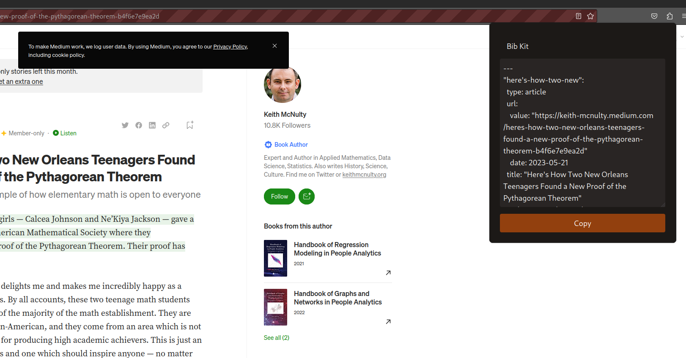

# Bib Kit - Hayagriva Extension for Firefox 📚

This extension allows retrieving website information to create
citations in the `hayagriva` format.

## Warning

This extension is highly experimental. Bugs are expected.
If you encounter any feel free to create issues.
I do not recommend using the extension at this state.
If you are curious however what is working so far you can install
the extension [here](https://addons.mozilla.org/en-US/firefox/addon/bib-kit/)

## Screenshot

## Roadmap

- [ ] create more data extractors (e.g. dublin-core)
- [ ] better error handling (expose errors better to javascript)
- [ ] better data validation

## Building

#### With Nix

When you have the nix package manager installed you can just go into the root directory of this project and follow these instructions:

1. Run `nix develop` to create a shell with all necessary programs and dependencies
2. Go into the `html-meta` directory and run `just build`
3. Go back to the main directory and run `just build`
4. The extension should be built inside the `build` directory

#### Other Platforms

Install the following packages on your system:

- `just`: Task runner similar to make
- `wasm-pack`: Used to create the wasm bindings
- `web-ext`: Used to build the extension
- `cargo`: Rust's package manager and build tool

Make sure your Rust installation is able to target `wasm32-unknown-unknown`

1. Go into the `html-meta` directory and run `just build`
2. Go back to the main directory and run `just build`
3. The extension should be built inside the `build` directory

## License

The icon made by Iconsax and all the source code is published under the MIT license.

## References

- [Hayagriva](https://github.com/typst/hayagriva) - the citation format
- [Typst](https://github.com/typst/typst) - a new markup-based typesetting format

## Acknowledgements

- [Icon](https://www.svgrepo.com/svg/495072/book-square) - made by Iconsax